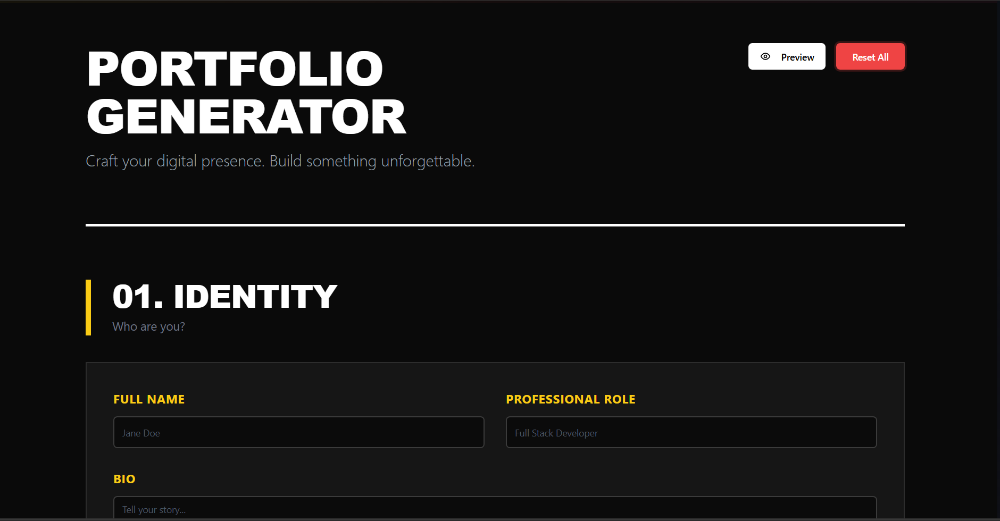
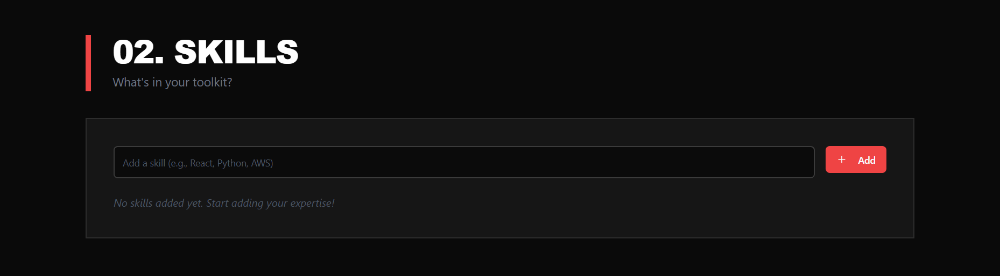
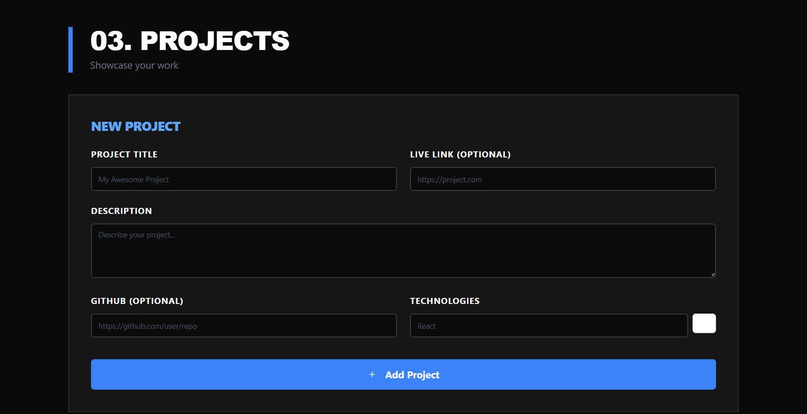
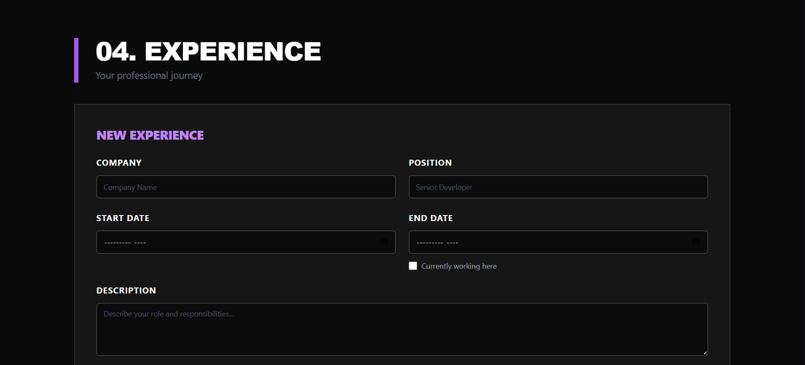
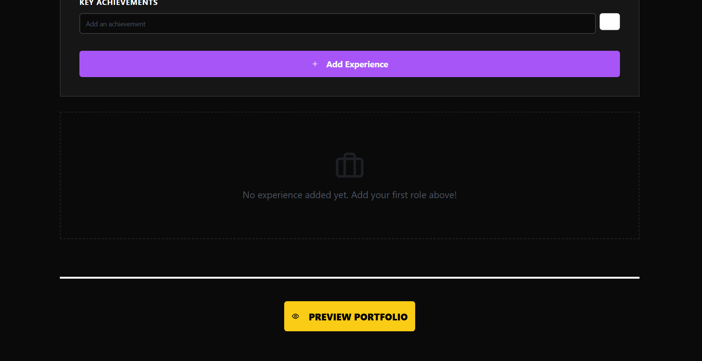

<div align="center">

# 🎨 Portfolio Generator



<p align="center">
  <strong>A modern, feature-rich portfolio builder with 4 stunning themes</strong>
</p>

<p align="center">
  
  
  
  
</p>

<p align="center">
  <a href="#-demo">Demo</a> •
  <a href="#-features">Features</a> •
  <a href="#-quick-start">Quick Start</a> •
  <a href="#-themes">Themes</a> •
  <a href="#-tech-stack">Tech Stack</a>
</p>

<br>

<table>
<tr>
<td width="50%">

### 🚀 Zero Configuration
Start building immediately with no setup required

</td>
<td width="50%">

### 💾 Auto-Save
Never lose your progress with automatic storage

</td>
</tr>
<tr>
<td width="50%">

### 🎨 4 Unique Themes
From brutalist to neon - find your perfect style

</td>
<td width="50%">

### 📱 Fully Responsive
Beautiful on desktop, tablet, and mobile

</td>
</tr>
</table>

</div>

---

## 📖 Overview

<table>
<tr>
<td width="60%">

**Portfolio Generator** is a professional-grade web application that empowers developers, designers, and creators to build stunning portfolio websites without writing code.

### ✨ Key Highlights

- 🎯 **Intuitive Interface** - Build your portfolio in minutes
- 🔄 **Real-time Preview** - See changes instantly
- 📤 **Export Ready** - Download as standalone HTML
- ⚡ **Lightning Fast** - Optimized performance
- 🎨 **Design Freedom** - Multiple professional themes
- 💡 **Smart Validation** - Prevents empty submissions

</td>
<td width="40%">

```typescript
// Built with modern tech
const stack = {
  framework: "Next.js 14",
  language: "TypeScript",
  styling: "Tailwind CSS",
  state: "Context API",
  storage: "LocalStorage",
  icons: "Lucide React"
};
```

</td>
</tr>
</table>

---

## 🎬 Demo

<details open>
<summary><b>📸 View Screenshots</b></summary>

<br>

<table>
<tr>
<td colspan="2">

### 🏠 Home Screen


> The main editor interface where you build your portfolio with an intuitive, section-based layout featuring bold typography and modern design.

</td>
</tr>

<tr>
<td width="50%">

### 👤 Identity Section


> Add your personal information, professional role, bio, and contact details with a clean form interface.

</td>
<td width="50%">

### 🎯 Skills Showcase


> Tag-based skill management with easy add/remove functionality and beautiful badge design.

</td>
</tr>

<tr>
<td width="50%">

### 💼 Project Portfolio


> Showcase your work with rich descriptions, tech stacks, and live links to projects.

</td>
<td width="50%">

### 📈 Professional Experience


> Document your career journey with achievements, responsibilities, and timeline.

</td>
</tr>

<tr>
<td colspan="2">

### 🎨 Preview & Export


> Real-time preview with theme switching and one-click HTML export functionality.

</td>
</tr>
</table>

</details>

---

## ✨ Features

<div align="center">

### 🎨 Multiple Themes

<table>
<tr>
<th width="25%">Theme</th>
<th width="35%">Style</th>
<th width="40%">Best For</th>
</tr>
<tr>
<td align="center">
<br>

<br><br>
</td>
<td>
<b>Bold • Editorial • High-Impact</b><br>
Sharp borders, strong typography, maximum contrast
</td>
<td>
Creative professionals, designers, artists, content creators
</td>
</tr>
<tr>
<td align="center">
<br>

<br><br>
</td>
<td>
<b>Clean • Refined • Sophisticated</b><br>
Generous whitespace, elegant typography, subtle details
</td>
<td>
Corporate professionals, consultants, executives, writers
</td>
</tr>
<tr>
<td align="center">
<br>

<br><br>
</td>
<td>
<b>Modern • Translucent • Colorful</b><br>
Blur effects, gradient backgrounds, soft shadows
</td>
<td>
Tech professionals, startups, innovators, product managers
</td>
</tr>
<tr>
<td align="center">
<br>

<br><br>
</td>
<td>
<b>Futuristic • Cyberpunk • Glowing</b><br>
Neon accents, grid backgrounds, monospace fonts
</td>
<td>
Developers, gamers, tech enthusiasts, digital artists
</td>
</tr>
</table>

</div>

---

### 📝 Content Management

<table>
<tr>
<td width="33%">

#### 👤 Personal Info
- Full Name
- Professional Role  
- Bio/Introduction
- Email Address
- Location
- Phone Number

</td>
<td width="33%">

#### 🔗 Social Links
- GitHub Profile
- LinkedIn Profile
- Twitter/X Handle
- Personal Website
- Dribbble
- Behance

</td>
<td width="33%">

#### 🎯 Portfolio Items
- Skills & Technologies
- Project Showcase
- Work Experience
- Achievements
- Education
- Certifications

</td>
</tr>
</table>

---

### 💡 Smart Features

<div align="center">

| Feature | Description |
|---------|-------------|
| 🔄 **Real-time Preview** | See your portfolio update instantly as you type |
| 💾 **Auto-save** | Automatic local storage - never lose your work |
| 📤 **HTML Export** | Download complete standalone portfolio file |
| 🎯 **Validation** | Smart form validation prevents errors |
| 📱 **Responsive Design** | Perfect on mobile, tablet, and desktop |
| ⚡ **Performance** | Lightning-fast load times and interactions |
| 🎨 **Theme Switching** | Change themes in real-time preview |
| 🔍 **SEO Ready** | Semantic HTML for search engines |

</div>

---

## 🚀 Quick Start

<details>
<summary><b>📦 Installation Guide</b></summary>

<br>

### Prerequisites

```bash
# Check Node.js version (should be 18+)
node --version

# Check npm version
npm --version
```

### Method 1: Quick Install (Recommended)

```bash
# Clone and start in one line
git clone https://github.com/yourusername/portfolios-generator.git && cd portfolios-generator && npm install && npm run dev
```

### Method 2: Step by Step

```bash
# 1. Clone the repository
git clone https://github.com/yourusername/portfolios-generator.git

# 2. Navigate to directory
cd portfolios-generator

# 3. Install dependencies
npm install

# 4. Start development server
npm run dev
```

### Method 3: Using npx (No Clone)

```bash
npx create-next-app@latest portfolios-generator --typescript --tailwind --app
cd portfolios-generator
npm run dev
```

### 🌐 Access the Application

Open your browser and navigate to:
```
http://localhost:3000
```

</details>

---

## 📁 Project Structure

<details>
<summary><b>🗂️ View File Structure</b></summary>

<br>

```
portfolios-generator/
│
├── 📁 app/
│   ├── 📄 page.tsx              # Main editor interface
│   ├── 📄 layout.tsx            # Root layout with providers
│   ├── 📄 globals.css           # Global styles & Tailwind
│   │
│   └── 📁 preview/
│       └── 📄 page.tsx          # Preview page with themes
│
├── 📁 components/
│   └── 📁 ui/                   # Reusable UI components
│       ├── 📄 button.tsx        # Button component
│       ├── 📄 input.tsx         # Input field
│       ├── 📄 textarea.tsx      # Text area
│       ├── 📄 label.tsx         # Form labels
│       └── 📄 badge.tsx         # Badge/tag component
│
├── 📁 context/
│   └── 📄 PortfolioContext.tsx  # Global state management
│
├── 📁 lib/
│   ├── 📄 types.ts              # TypeScript type definitions
│   └── 📄 utils.ts              # Utility functions
│
├── 📁 public/                   # Static assets
│   ├── 🖼️ home.png
│   ├── 🖼️ identity.png
│   ├── 🖼️ skills.png
│   ├── 🖼️ projects.png
│   ├── 🖼️ experience.png
│   └── 🖼️ footer.png
│
├── 📄 package.json              # Dependencies
├── 📄 tsconfig.json             # TypeScript config
├── 📄 tailwind.config.js        # Tailwind configuration
├── 📄 next.config.js            # Next.js configuration
└── 📄 README.md                 # You are here!
```

</details>

---

## 🎨 Themes

<table>
<tr>
<td width="50%">

### 🎯 Brutalist Theme

**Design Philosophy:** Bold, Impactful, Unforgettable

<details>
<summary>View Details</summary>

<br>

**Typography:**
- Headlines: `Arial Black`
- Body: `Helvetica Neue`

**Color Palette:**
```css
--bg: #0a0a0a (Black)
--accent-1: #facc15 (Yellow)
--accent-2: #ef4444 (Red)
--accent-3: #3b82f6 (Blue)
--accent-4: #a855f7 (Purple)
```

**Key Features:**
- ✅ Sharp geometric borders
- ✅ High contrast text
- ✅ Noise texture overlay
- ✅ Staggered animations
- ✅ Bold section dividers

**Best For:**  
Creative professionals, graphic designers, art directors, content creators

</details>

</td>
<td width="50%">

### 🤍 Minimal Theme

**Design Philosophy:** Less is More

<details>
<summary>View Details</summary>

<br>

**Typography:**
- Headlines: `Playfair Display`
- Body: `Inter`

**Color Palette:**
```css
--bg: #ffffff (White)
--text: #111827 (Dark Gray)
--accent: #6b7280 (Medium Gray)
--border: #e5e7eb (Light Gray)
```

**Key Features:**
- ✅ Generous whitespace
- ✅ Elegant serif headers
- ✅ Subtle hover effects
- ✅ Clean line separators
- ✅ Refined spacing

**Best For:**  
Corporate professionals, consultants, executives, academic researchers

</details>

</td>
</tr>

<tr>
<td width="50%">

### 🌈 Glassmorphic Theme

**Design Philosophy:** Modern & Translucent

<details>
<summary>View Details</summary>

<br>

**Typography:**
- All Text: `Montserrat`

**Color Palette:**
```css
--gradient: linear-gradient(
  135deg, 
  #667eea 0%, 
  #764ba2 100%
)
--glass: rgba(255,255,255,0.1)
--blur: 24px
```

**Key Features:**
- ✅ Backdrop blur effects
- ✅ Animated gradient blobs
- ✅ Frosted glass panels
- ✅ Soft shadows
- ✅ Colorful accents

**Best For:**  
Tech professionals, startup founders, product managers, UX designers

</details>

</td>
<td width="50%">

### ⚡ Neon Theme

**Design Philosophy:** Futuristic & Cyberpunk

<details>
<summary>View Details</summary>

<br>

**Typography:**
- All Text: `Orbitron` (Monospace)

**Color Palette:**
```css
--bg: #000000 (Black)
--neon-cyan: #00ffff
--neon-pink: #ff00ff
--grid: rgba(0,255,255,0.1)
```

**Key Features:**
- ✅ Glowing neon borders
- ✅ Grid background pattern
- ✅ Text shadow effects
- ✅ Monospace typography
- ✅ Futuristic animations

**Best For:**  
Software developers, game developers, cybersecurity experts, tech enthusiasts

</details>

</td>
</tr>
</table>

---

## 📚 Documentation

<details>
<summary><b>📖 Complete Usage Guide</b></summary>

<br>

### Building Your Portfolio

#### 🎯 Step 1: Personal Information

Navigate to the **"01. Identity"** section and fill in:

```javascript
{
  name: "Your Full Name",
  role: "Your Professional Title",
  bio: "A compelling 2-3 sentence introduction",
  email: "your.email@example.com",
  location: "City, Country"
}
```

**Tips:**
- Keep your role concise (e.g., "Full Stack Developer")
- Make your bio engaging and personality-driven
- Use a professional email address

---

#### 🔗 Step 2: Social Links

Add your online presence:

| Platform | Format |
|----------|--------|
| GitHub | `https://github.com/username` |
| LinkedIn | `https://linkedin.com/in/username` |
| Twitter | `https://twitter.com/username` |
| Website | `https://yourwebsite.com` |

---

#### 🎯 Step 3: Add Skills

**How to add:**
1. Type skill name in the input field
2. Press `Enter` or click "Add" button
3. Skill appears as a badge

**How to remove:**
- Click on any skill badge to remove it

**Best Practices:**
```
✅ Good: "React", "TypeScript", "Node.js", "AWS"
❌ Avoid: "Good at coding", "Team player"
```

---

#### 💼 Step 4: Create Projects

For each project, provide:

<table>
<tr>
<th>Field</th>
<th>Description</th>
<th>Required</th>
</tr>
<tr>
<td><b>Title</b></td>
<td>Project name</td>
<td>✅ Yes</td>
</tr>
<tr>
<td><b>Description</b></td>
<td>What it does, your role</td>
<td>✅ Yes</td>
</tr>
<tr>
<td><b>Technologies</b></td>
<td>Tech stack used</td>
<td>✅ Yes</td>
</tr>
<tr>
<td><b>Live Link</b></td>
<td>Deployed URL</td>
<td>❌ Optional</td>
</tr>
<tr>
<td><b>GitHub</b></td>
<td>Repository URL</td>
<td>❌ Optional</td>
</tr>
</table>

**Example:**
```
Title: E-commerce Platform
Description: Built a full-stack e-commerce platform with payment integration, 
             user authentication, and admin dashboard. Handles 10,000+ daily users.
Tech: React, Node.js, PostgreSQL, Stripe, AWS
Live: https://myshop.com
GitHub: https://github.com/username/ecommerce
```

---

#### 📈 Step 5: Document Experience

Add work history with:

```javascript
{
  company: "Company Name",
  position: "Your Job Title",
  startDate: "2022-01",
  endDate: "2024-12", // or leave empty if current
  current: false, // check if currently working
  description: "Brief role description",
  achievements: [
    "Increased performance by 40%",
    "Led team of 5 developers",
    "Shipped 3 major features"
  ]
}
```

---

#### 🎨 Step 6: Preview & Export

1. Click **"Preview Portfolio"** button
2. Browse through 4 theme options:
   - Brutalist
   - Minimal
   - Glassmorphic
   - Neon
3. Click theme name to switch
4. Click **"Export HTML"** to download

**Export Benefits:**
- ✅ Standalone HTML file
- ✅ All styles embedded
- ✅ Works offline
- ✅ Easy to host anywhere

</details>

---

## 🛠️ Tech Stack

<div align="center">

### Core Technologies

<table>
<tr>
<td align="center" width="20%">

<br><b>Next.js 14</b>
<br><sub>React Framework</sub>
</td>
<td align="center" width="20%">

<br><b>TypeScript</b>
<br><sub>Type Safety</sub>
</td>
<td align="center" width="20%">

<br><b>Tailwind CSS</b>
<br><sub>Styling</sub>
</td>
<td align="center" width="20%">

<br><b>React 18</b>
<br><sub>UI Library</sub>
</td>
<td align="center" width="20%">

<br><b>Node.js</b>
<br><sub>Runtime</sub>
</td>
</tr>
</table>

### Libraries & Tools

| Category | Technology | Purpose |
|----------|-----------|---------|
| 🎨 **UI Components** | Radix UI | Accessible primitives |
| 🎨 **Styling** | Tailwind CSS | Utility-first CSS |
| 🖼️ **Icons** | Lucide React | Beautiful icons |
| 📦 **State Management** | Context API | Global state |
| 💾 **Storage** | LocalStorage | Data persistence |
| 🎭 **Variants** | CVA | Component variants |
| 🔧 **Utils** | clsx, tailwind-merge | Class management |

</div>

---

## 🎯 Use Cases

<table>
<tr>
<td width="50%">

### 👔 Professional Scenarios

- **Job Applications** - Impress recruiters
- **Freelancing** - Attract clients  
- **Personal Branding** - Build online presence
- **Networking** - Share your work easily
- **Career Transitions** - Showcase new skills

</td>
<td width="50%">

### 🎓 Educational Scenarios

- **Student Projects** - Academic portfolio
- **Bootcamp Graduates** - First portfolio
- **Self-taught Developers** - Skill demonstration
- **Side Projects** - Hobby showcase
- **Open Source** - Contribution history

</td>
</tr>
</table>

---

## 📱 Responsive Design

<div align="center">

### Breakpoints

| Device | Breakpoint | Layout |
|--------|-----------|--------|
| 📱 **Mobile** | < 640px | Single column, stacked |
| 📱 **Tablet** | 640px - 1024px | Flexible grid |
| 💻 **Desktop** | > 1024px | Full multi-column |

</div>

**Features:**
- ✅ Mobile-first approach
- ✅ Touch-friendly interactions
- ✅ Optimized typography scaling
- ✅ Responsive images
- ✅ Flexible layouts

---

## 🚀 Deployment

<details>
<summary><b>☁️ Deploy to Vercel (Recommended)</b></summary>

<br>

```bash
# Install Vercel CLI
npm i -g vercel

# Deploy
vercel
```

**Or use the Vercel Dashboard:**
1. Push code to GitHub
2. Import repository in Vercel
3. Deploy automatically

</details>

<details>
<summary><b>🌐 Deploy to Netlify</b></summary>

<br>

```bash
# Install Netlify CLI
npm i -g netlify-cli

# Build
npm run build

# Deploy
netlify deploy --prod
```

</details>

<details>
<summary><b>📄 Static Export</b></summary>

<br>

```bash
# Build static files
npm run build

# Files in /out directory
# Upload to any static host
```

</details>

---

## 🔧 Development

<details>
<summary><b>⚙️ Available Scripts</b></summary>

<br>

```bash
# Development
npm run dev          # Start dev server (port 3000)
npm run dev -- -p 3001  # Custom port

# Production
npm run build        # Create optimized build
npm run start        # Start production server

# Code Quality
npm run lint         # Run ESLint
npm run type-check   # TypeScript check

# Cleanup
npm run clean        # Remove build files
```

</details>

<details>
<summary><b>🎨 Customization</b></summary>

<br>

### Change Theme Colors

Edit `app/page.tsx` and `app/preview/page.tsx`:

```javascript
// Example: Change yellow accent to orange
className="border-yellow-400"  // Old
className="border-orange-400"  // New
```

### Add New Fonts

In `app/layout.tsx`:

```html
<link href="https://fonts.googleapis.com/css2?family=YourFont&display=swap" rel="stylesheet" />
```

Then update inline styles:
```javascript
style={{ fontFamily: 'YourFont, sans-serif' }}
```

### Create Custom Theme

1. Add theme to `themes` object in `app/preview/page.tsx`
2. Update type in `lib/types.ts`
3. Add selector button

</details>

---

## 🤝 Contributing

<div align="center">

We love contributions! Here's how you can help:

| Type | How to Contribute |
|------|------------------|
| 🐛 **Bug Reports** | [Open an issue](https://github.com/yourusername/portfolios-generator/issues) |
| ✨ **Feature Requests** | [Start a discussion](https://github.com/yourusername/portfolios-generator/discussions) |
| 📝 **Documentation** | Improve README or add guides |
| 🎨 **Themes** | Create new theme variations |
| 💻 **Code** | Submit pull requests |

</div>

### Development Workflow

```bash
# 1. Fork the repository

# 2. Clone your fork
git clone https://github.com/YOUR_USERNAME/portfolios-generator.git

# 3. Create a feature branch
git checkout -b feature/amazing-feature

# 4. Make your changes

# 5. Commit with conventional commits
git commit -m "feat: add amazing feature"

# 6. Push to your fork
git push origin feature/amazing-feature

# 7. Open a Pull Request
```

---

## 📄 License

<div align="center">

```
MIT License

Copyright (c) 2024 Portfolio Generator

Permission is hereby granted, free of charge, to any person obtaining a copy
of this software and associated documentation files (the "Software"), to deal
in the Software without restriction, including without limitation the rights
to use, copy, modify, merge, publish, distribute, sublicense, and/or sell
copies of the Software, and to permit persons to whom the Software is
furnished to do so, subject to the following conditions:

The above copyright notice and this permission notice shall be included in all
copies or substantial portions of the Software.
```

[Read Full License](LICENSE)

</div>

---

## 🙏 Acknowledgments

<table>
<tr>
<td width="50%">

### 📚 Resources

- [Next.js Documentation](https://nextjs.org/docs)
- [Tailwind CSS](https://tailwindcss.com)
- [TypeScript Handbook](https://www.typescriptlang.org/docs)
- [React Documentation](https://react.dev)

</td>
<td width="50%">

### 🎨 Inspiration

- [Brutalist Web Design](https://brutalist-web.design)
- [Awwwards](https://awwwards.com)
- [Dribbble](https://dribbble.com)
- [Behance](https://behance.net)

</td>
</tr>
</table>

---

## 📞 Support

<div align="center">

### Need Help?

<table>
<tr>
<td align="center" width="33%">
<br>
<b>📧 Email</b>
<br><br>
<a href="mailto:yogsthapa@gmail.com.com">support@portfoliogenerator.com</a>
<br><br>
</td>
<td align="center" width="33%">
<br>
<b>🐛 Issues</b>
<br><br>
<a href="https://github.com/yogeshthapa-7/portfolios-generator/issues">GitHub Issues</a>
<br><br>
</td>
<td align="center" width="33%">
<br>
<b>💬 Discussions</b>
<br><br>
<a href="https://github.com/yogeshthapa-7/portfolios-generator/discussions">GitHub Discussions</a>
<br><br>
</td>
</tr>
</table>

</div>

---

## 🗺️ Roadmap

<details>
<summary><b>🚀 Planned Features</b></summary>

<br>

### Version 2.0 (Q1 2024)
- [ ] 🎨 3 Additional themes (Art Deco, Retro, Magazine)
- [ ] 📸 Image upload for projects
- [ ] 🎨 Custom color picker
- [ ] 📱 Mobile app (React Native)

### Version 2.5 (Q2 2024)
- [ ] 🌐 Custom domain integration
- [ ] 📊 Analytics dashboard
- [ ] 🔍 SEO optimization tools
- [ ] 🌍 Multi-language support

### Version 3.0 (Q3 2024)
- [ ] 📄 PDF export
- [ ] 🛒 Template marketplace
- [ ] 🔄 Version control for portfolios
- [ ] 🤝 Team collaboration features

### Future Ideas
- [ ] 🎬 Video backgrounds
- [ ] ✨ Animation builder
- [ ] 🔌 Plugin system
- [ ] 🎯 A/B testing
- [ ] 📧 Contact form integration
- [ ] 💳 Payment gateway for services

</details>

---

## 📊 Stats

<div align="center">


</div>

---

## 💖 Support the Project

<div align="center">

If you find this project helpful, please consider:

⭐ **Star this repository**  
🐦 **Share on Twitter**  
📝 **Write a blog post**  
☕ **Buy me a coffee**

<br>

**Built with ❤️ by developers, for developers**

<br>

[](https://github.com/yogeshthapa-7)
[](https://opensource.org)

</div>

---

<div align="center">

### 🌟 Star History

[](https://star-history.com/yogeshthapa-7/portfolios-generator&Date)

<br><br>

**[⬆ Back to Top](#-portfolios-generator)**

<br>

---

<sub>Made with Next.js • TypeScript • Tailwind CSS</sub>

</div>